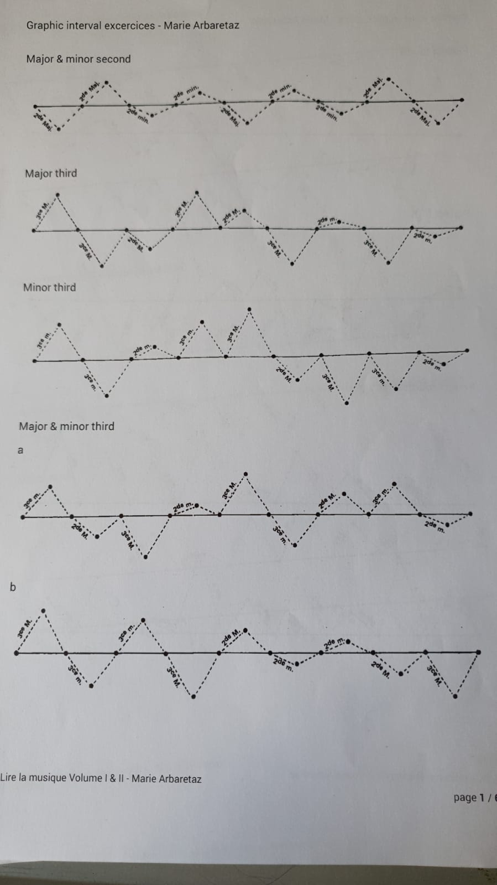
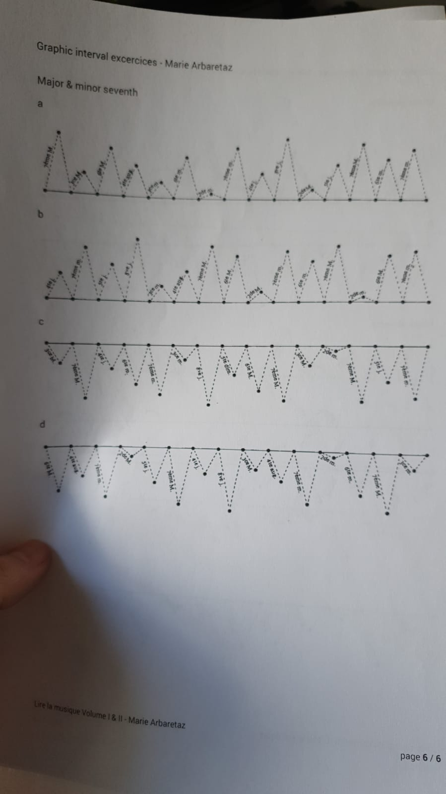

# Interval Practice Application

An application to help you practice your intervals. This app creates exercises based on those shown below.
Exercises are created at random so the user always has a fresh, and depending on the operating system they are using, can have the exercise played back to them to check if they were right.

The Python file of the latest release is '/main.py'. The executable of the latest release is '/latest.exe'. For all releases please see 'exes' or 'pys' folders.

WIPs:
- Colour schemes?

